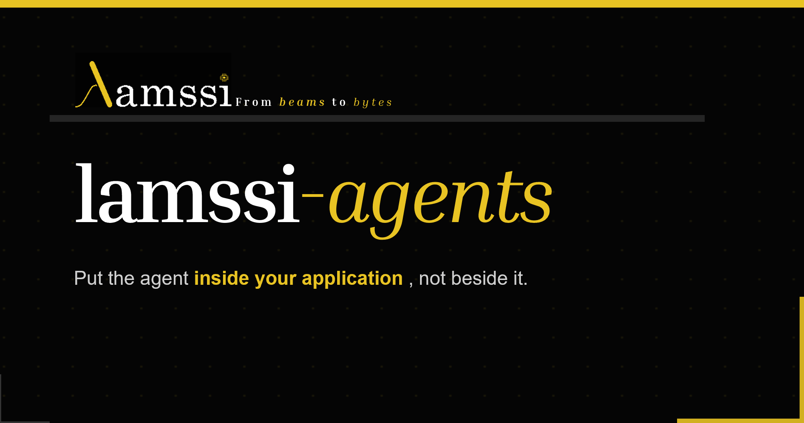
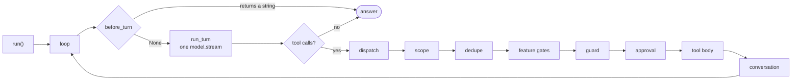

<p align="center">
  
</p>

<p align="center">
<strong>An in-process agent runtime for Python applications.</strong>
</p>

<p align="center">
  <a href="#quickstart">Quickstart</a>
  &nbsp;·&nbsp;
  <a href="#why-in-process">Why in-process</a>
  &nbsp;·&nbsp;
  <a href="#what-you-compose">Features</a>
  &nbsp;·&nbsp;
  <a href="#reaching-your-application">Capabilities</a>
  &nbsp;·&nbsp;
  <a href="#threads">Threads</a>
  &nbsp;·&nbsp;
  <a href="examples/">Examples</a>
  &nbsp;·&nbsp;
  <a href="ARCHITECTURE.md">Architecture</a>
</p>
---

> **Status:** `0.1.x`. The core invariants are tested. Minor releases may refine the
> public API before 1.0.

## What is lamssi-agents?

A model loop with tools, skills, memory, and prompt composition that runs
directly in your Python process. Where most agent stacks put an HTTP tool server,
subprocess, or async gateway between the model and your application, here a tool call
invokes your Python object directly. It is synchronous by design.

lamssi-agents was extracted from [Efaino](https://lamssi.com/software), a platform to control
real hardware and build applications, extensible with device plugins and libraries.
Its synchronous, in-process design comes from that origin: a tool call has to reach a real
device and return before the model moves on.

Compose an `Agent` from a model, instructions, tools, context, and optional features. A
bare `Agent()` starts with an empty prompt and tool surface, and its composition is visible
in the constructor call.

```python
from lamssi_agents import Agent
from lamssi_agents import Files, Guidance, Memory, SystemTools

agent = Agent(
    "claude-sonnet-4-5",
    instructions="You help maintain this application.",
    features=[SystemTools(), Guidance(), Files("."), Memory()],
)
result = agent.run("Find the slowest test and explain why.")
print(result.text)
```

`run()` returns a structured `RunResult`; `chat()` is the blocking `str` convenience.
The runtime API is synchronous, and `src/` contains no `asyncio`. GUI and async hosts can
call it from a worker thread or executor.

## Why in-process

Any boundary between the model and your application must be crossed on every tool call. For
an application that controls an instrument, stage, shutter, robot, or live document, the host
must preserve completion and ordering across it.

If a bridge treats dispatch as completion, `move_to(10.0)` returns as soon as the message
is accepted. The following `get_position()` can run while the stage is still moving and
return `0.0`. The value passes its range, unit, and schema checks, but describes an earlier
state. A synchronous RPC can provide the required guarantee when the host implements and
tests its completion semantics.

In-process, `move_to` calls your method directly. The following read begins after that
method returns, using the application's existing call ordering.

**A tool call is complete when its Python body returns, not when the hardware settles.**
Blocking until the stage reaches its target is the tool's job; a body that cannot wait
should return a status like `{"status": "ramping", "settled": false}` rather than a bare
success.

The integration tests cover three properties:

| | |
| --- | --- |
| **Inline by default** | Without a dispatcher, a tool body runs on the thread that called `chat()`. A host may synchronously hand selected calls to another thread. |
| **Sequential** | Tool calls announced in one message run one at a time to completion, in the order asked. |
| **By reference** | A tool receives your live object, such as an open port, driver handle, or array. |

Importing `lamssi_agents` has no startup side effects. Constructing an `Agent` also starts
no background work. Each active LiteLLM stream uses one short-lived daemon reader thread
so an abort lands within about 100 ms when the stream is idle. Tool execution remains
synchronous from the loop's point of view.

## Project scope

lamssi-agents provides the in-process runtime. The host application owns the surrounding
product and infrastructure:

| Owned by the host | Integration |
| --- | --- |
| **CLI product** | `lamssi_cli` is a small reference host for the embedding API. |
| **UI, TUI, or web frontend** | The runtime emits events for the host to render. |
| **Service, gateway, or task queue** | The host may add a boundary and must preserve call completion and ordering across it. |
| **Async scheduling** | Call `chat()` from a thread or executor in an async application. |
| **Plugin lifecycle** | Composition is explicit; hosts can mount a live tool registry for dynamic tools. |
| **Storage and application services** | Persistence, authentication, transport, and UI remain application concerns. |

New runtime features should have a clear owner. Host-owned services stay in the host.
The extension points available to them are catalogued in
[docs/capability-seams.md](docs/capability-seams.md).

## Install

Python **3.12+** and [uv](https://docs.astral.sh/uv/) are required. The package is not
yet published to PyPI. Add the current GitHub version to an existing uv project with:

```bash
uv add "lamssi-agents @ git+https://github.com/lamssi/lamssi-agents.git"
```

To run from a repository checkout:

```bash
git clone https://github.com/lamssi/lamssi-agents.git
cd lamssi-agents
uv sync --locked
uv run lamssi-agent
```

The committed `uv.lock` is part of the repository and should be uploaded with the source.
`uv sync --locked` installs the exact resolved environment and fails if `pyproject.toml`
and the lock file disagree.

The runtime declares three direct dependencies: `litellm`, `pydantic`, and `pyyaml`.
Heavier readers are optional and imported only when used. Enable them in a checkout with:

```bash
uv sync --locked --extra documents   # PDF, DOCX, PPTX, HTML
uv sync --locked --extra tables      # pandas, numpy, openpyxl, scipy, h5py, npTDMS
uv sync --locked --extra vision      # pillow, numpy: chat(image=...)
```

For an application that depends on a GitHub extra, include the extra in `uv add`, for
example `uv add "lamssi-agents[vision] @ git+https://github.com/lamssi/lamssi-agents.git"`.

## Quickstart

```python
from lamssi_agents import Agent

agent = Agent(
    "openai/gpt-5-mini",
    instructions="You are the assistant inside our device-control application.",
)
print(agent.chat("Hello"))
```

Cloud identifiers use the provider's normal credential environment variables; the
example above needs `OPENAI_API_KEY`. For an OpenAI-compatible local server such as LM
Studio, configure the endpoint explicitly. The `openai/` prefix selects its wire
protocol; `api_base` selects the server:

```python
from lamssi_agents import Agent, LiteLLMModel

agent = Agent(
    LiteLLMModel(
        "openai/qwen3-8b",
        api_base="http://127.0.0.1:1234/v1",
        context_window=32_768,
    ),
    instructions="You are the assistant inside our device-control application.",
)
```

This configuration starts with an empty tool surface. Install the features required by
the application:

```python
from lamssi_agents import Files, Guidance, Memory, SystemTools

agent = Agent(
    "openai/gpt-5-mini",
    instructions="You help operate and maintain this application.",
    features=[
        SystemTools(),
        Guidance(),
        Files(".", read_only=[("../reference", "Reference documentation")]),
        Memory(),
    ],
)
```

The string passed as `instructions` is the complete base prompt. Additional prompt
content comes from explicitly installed features and context blocks. `Guidance()` is
optional. `agent.explain_prompt()` lists every block, its source, named position,
cacheability, and size.

Approval has two independent halves: a tool declares when it is risky, and the host
chooses how to answer. Named constructors make the host policy explicit:

```python
from lamssi_agents import ApprovalPolicy, ApprovalRequest, ToolApproval

def approve(request: ApprovalRequest):
    print(request.tool, request.arguments, request.reason)
    return ToolApproval.APPROVE  # normally open a UI and return its answer

agent = Agent(
    "openai/gpt-5-mini",
    instructions="You operate the device console.",
    approval=ApprovalPolicy.ask_when_required(approve),
)
```

For unattended runs choose `reject_when_required()` or `allow_all()`.
`ask_for_everything(handler)` ignores tool risk declarations and asks for every call.
Loop guards and domain safety checks remain active under every agent-level approval
policy.

Consent and questions are separate channels. `SystemTools()` exposes `ask_user`, but it
can reach a person only when the Agent has an `interaction=` handler returning an
`InteractionResponse`:

```python
from lamssi_agents import Agent, InteractionRequest, InteractionResponse, SystemTools
from lamssi_agents.interaction import InteractionKind

def interact(request: InteractionRequest) -> InteractionResponse:
    if request.kind is InteractionKind.QUESTION:
        return InteractionResponse.answered(input(f"{request.prompt}\n> "))
    return InteractionResponse.cancel()  # Do not approve checkpoints implicitly.

agent = Agent(
    "openai/gpt-5-mini",
    features=[SystemTools()],
    interaction=interact,
)
```

The handler runs synchronously on the agent thread. GUI hosts can present the request on
their UI thread and block until it returns a response; `request.request_id` correlates
the corresponding events. See [the hosting guide](docs/hosting.md#typed-interaction-and-approval)
for interaction and approval together.

`Agent("model-name")` creates a `LiteLLMModel`. The local-server example above shows how
to construct it for explicit endpoint and call settings. A custom adapter is accepted
through the same `model` argument:

```python
custom = Agent(model=MyQtHostedModel(...))
```

A custom `Model` publishes a model identifier and implements `stream(...)`. Metadata and
diagnostics are optional. `agent.use_model(...)` replaces the adapter through the same
string-or-object argument.

Compaction summaries use the active main model by default. An advanced integration may
assign a separate adapter with `agent.summary_model = model`; assigning `None` restores
the default. This stays out of construction so the ordinary API still has one model
argument.

## What you compose

Features are optional and explicit; list order is hook order. `SystemTools()` and
`Guidance()` are separate so installing tools does not silently change the prompt.

| Feature | Constructor | Contributes |
| --- | --- | --- |
| `SystemTools()` |  | `ask_user`, `abort`, and default guard roles |
| `Guidance()` |  | Lamssi's conditional operating-guidance prompt |
| `Files()` | `Files(root=None, *, read_only=(), on_write=(), protected_paths=(".git", ".lamssi"))` | `read_file`, `fs`, `write_file`, `edit_file`, and `delete_file`, plus the `safe_when` checks that keep workspace reads from prompting |
| `Shell()` | `Shell(prefer="")` | One of `run_bash` or `run_powershell`, selected from the shells available at installation. Each tool documents its shell syntax. |
| `Code()` | `Code(executor=None)` | `execute_code` when a `CodeExecutor` capability is provided; otherwise the tool is omitted from the schema |
| `Memory()` | `Memory(path=".lamssi/memory")` | `memory` (recall/list are read-only; remember/forget require approval), stored at the explicit path relative to `Files` |
| `Skills()` | `Skills(*roots, entries=(), loader=None, include_builtin=False, allow_model_loading=False)` | a skill catalogue in the prompt; `load_skill` when explicitly exposed to the model |
| `Budget()` | `Budget(every_tokens)` | a `before_turn` checkpoint that asks whether an expensive run should continue |

The common features are exported from `lamssi_agents`. `Budget` is imported from
`lamssi_agents.features`.

History fitting and tool-result truncation are configuration, not features. Pass
`config=AgentConfig(compaction="summarise", history_budget_tokens=..., keep_recent=...,
max_tool_result_chars=...)` to the `Agent`, or set `agent.compactor` or `agent.truncator`
to a custom strategy.

Measured composition costs:

```
Agent()                                       0 tools registered,   0 visible to the model
Agent(features=[SystemTools()])               2                     1
Agent(features=[SystemTools(), Files(".")])   7                     6
+ Memory()                                    8                     7
+ Skills()                                    8                     7
```

`abort` is declared `Expose.HOST | Expose.MCP`, which keeps it out of the model's tool
count. `execute_code` declares `requires=CodeExecutor` and appears in the schema after the
host registers that capability.

The `Skills` feature owns its catalogue and runtime. A host can pin or inspect a skill
through the installed runtime. Pass `allow_model_loading=True` when the model should
receive `load_skill`:

```python
from lamssi_agents.features.skills import SkillRuntime

skills = agent.get(SkillRuntime)
if skills is not None:
    skills.load("code-assistance")
```

## Your own tools

```python
from lamssi_agents import Agent, tool
from lamssi_tools import CapabilityContext, Expose, Float


class Stage:
    def move_to(self, mm: float) -> None: ...
    def position(self) -> float: ...


@tool(
    inject_context=True,
    expose=Expose.AGENT,
    approval="always",
    parameters={"mm": Float("Target position in mm.", ge=0, le=50)},
)
def move_stage(ctx: CapabilityContext, mm: float) -> dict:
    """Move the translation stage and wait for it to settle."""
    stage = ctx.require(Stage)
    stage.move_to(mm)
    return {"position_mm": stage.position()}


agent = Agent("openai/gpt-5-mini", tools=[move_stage], capabilities={Stage: my_stage})
```

Omitting `expose=` makes a tool host-only; model visibility is an explicit opt-in.
Ordinary annotations keep the function natural to call and understand in an IDE. The
optional `parameters={...}` mapping adds descriptions and constraints to the JSON schema
with `Str`, `Int`, `Float`, `Bool`, `Array`, and `Object`.

An application can mount its existing live `ToolRegistry`:

```python
agent.mount_tools(coordinator.tool_registry)
...
agent.unmount_tools(coordinator.tool_registry)
```

Mounted tools are read live before every model call, so app/tool loading and unloading
take effect on the next turn. Calls run through the mounted registry's own dispatcher,
after the Agent's scope, guard, dedupe, and approval gates. `add_tools(...)` continues to
write only to the Agent's private registry; unmounting never changes the external one.
Duplicate names across live registries are rejected explicitly.

## Reaching your application

A tool asks for host objects **by type**, and gets the instance:

```python
agent.provide(Stage, stage)             # or Agent(capabilities={Stage: stage})
...
ctx.get(Stage)                          # None if absent
ctx.require(Stage)                      # raises CapabilityMissing, naming what is registered
ctx.get_all(Stage)                      # every registration, in order
```

Registering the same protocol twice appends another implementation. `get_all` returns
them in order, allowing the host to layer its implementation over a feature default. A
bare function is accepted where a single-method protocol is expected.

Capabilities connect framework tools to host implementations. For example, `Code()`
provides `execute_code` and the host supplies its Python interpreter.

## Threads

`chat()` blocks, so a desktop host runs it on a worker thread and the window keeps
painting. When a tool body must run somewhere specific, it says so, and your dispatcher
decides what that means:

```python
@tool(
    dispatch="gui",
    parameters={"celsius": Float("Target.", ge=0, le=300)},
)
def set_setpoint(celsius: float = 20.0) -> dict: ...

@tool(dispatch="worker")   # slow instrument; must not block the UI
def ramp_to_setpoint() -> dict: ...


def dispatch(definition, fn, kwargs):
    tag = getattr(definition, "dispatch", None)
    if tag == "gui":
        return gui(fn, **kwargs)
    if tag == "worker":
        return instrument.run(fn, dict(kwargs))
    return fn(**kwargs)


agent = Agent(...)
agent.set_tool_dispatcher(dispatch)
```

The tag is an opaque string interpreted by the host. Dispatch remains synchronous from
the loop's perspective: `chat()` resumes after the target thread returns a result.

The registry binds the current run context to `fn` before calling the dispatcher. The
host decides where it runs and returns the completed result synchronously.

With no dispatcher installed, a tagged body runs inline. `examples/17_desktop_app.py`
shows the complete Tkinter integration and prints the thread used by each tool.

## Safety

`Agent.__init__` installs the gate chain that runs before every tool body:

```
scope  ->  dedupe  ->  feature gates  ->  loop guard  ->  approval
```

Scope runs first and rejects calls outside the agent's allowed tool set. A feature's
`before_tool` gate runs after dedupe and before the guard and approval, allowing a host to
reject a call before either of those checks.

The application selects one approval policy for all tool calls:

| Policy | Meaning |
| --- | --- |
| `ApprovalPolicy.reject_when_required()` | run declared-safe calls and reject gated calls |
| `ApprovalPolicy.ask_when_required(handler)` | follow the tool declaration and ask when needed |
| `ApprovalPolicy.ask_for_everything(handler)` | ask before every tool call |
| `ApprovalPolicy.allow_all()` | skip agent-level consent for every tool call |

**Approval fails closed, and the default is unattended.** `Agent(...)` with no approval
policy uses `reject_when_required()`, which blocks every `approval="always"` tool such as
`run_bash`, `execute_code`, and `delete_file`. A blocked call appends one `tool` message so
the provider history remains structurally valid. `Feature.before_tool` blocks by returning
a result dictionary, which becomes that tool response.

An approval handler that raises is treated as a rejection. Approval succeeds for a
`ToolApproval` member or its exact string value. Booleans are rejected.

Secrets are masked on the way into history: `redact()` covers host-registered secrets plus
seven vendor key formats, and the shell tool builds its child environment through
`safe_environ()`, which strips credential variables by name *and* by value shape.

## How a turn runs



Each turn makes one `model.stream(...)` call. Runtime state has three lifetimes:

- **Composition:** tools, capabilities, prompt blocks, gates, and policy tables.
- **Run authority:** cancellation, events, approval, and typed interaction, owned by the
  agent's `RunControl`.
- **Conversation history:** the messages and per-conversation feature state.

Before every provider call, Lamssi fits the complete request, including prompt blocks and
tool schemas, into the model's input budget. A known overflow is rejected locally. The
default `"summarise"` strategy keeps a turn-safe recent tail; the advanced `"ladder"` may
demote tool results first. A custom strategy follows the same one-pass rule. The full
invariants are in
[ARCHITECTURE.md](ARCHITECTURE.md#context-control), with a custom strategy in
[`19_compaction_strategy.py`](examples/19_compaction_strategy.py).

## Writing a feature

A `Feature` implements `install` and may implement four runtime hooks:

```python
from lamssi_agents import Feature


class Instruments(Feature):
    name = "instruments"

    def install(self, agent):
        agent.add_tools(move_stage, read_power)
        agent.provide(Stage, self.stage)
        agent.add_context(bench_status_section)

    def before_tool(self, call, agent):
        if self.interlock_open:
            return {"error": "Safety interlock is open.", "retriable": False}
```

The other hooks are `before_turn`, `after_tool`, and `on_event`. `Agent.use` registers
overrides automatically; list order is hook order.

Store per-conversation state with `agent.conversation_state(Key, factory)`.

See [`12_custom_feature.py`](examples/12_custom_feature.py) and the
[feature architecture](ARCHITECTURE.md#features) for the complete contract.

## Examples

Runnable programs in [`examples/`](examples/). Most use a scripted model, so they
run with no API key and no network; set `LAMSSI_MODEL` to point them at a real one.

| | |
| --- | --- |
| [`01_hello.py`](examples/01_hello.py) | the smallest thing that works |
| [`02_your_own_tools.py`](examples/02_your_own_tools.py) | your own functions as tools |
| [`04_approval.py`](examples/04_approval.py) | deciding what needs your say-so |
| [`05_events.py`](examples/05_events.py) | observing structured run events |
| [`07_capabilities.py`](examples/07_capabilities.py) | a tool asking the host for something it cannot have itself |
| [`11_hosting_an_agent.py`](examples/11_hosting_an_agent.py) | a host composing an `Agent` directly |
| [`12_custom_feature.py`](examples/12_custom_feature.py) | packaging an integration as one explicit `Feature` |
| [`17_desktop_app.py`](examples/17_desktop_app.py) | **a real desktop app, with the agent on a worker thread** |
| [`18_pyside6_app.py`](examples/18_pyside6_app.py) | a complete Qt host with GUI and worker dispatch |

## Development

```bash
uv sync --locked --group dev
uv run pytest              # full suite
uv run pytest -m "not slow"
uv run lint-imports        # 7 architectural contracts, no exemptions
```

When dependencies change, run `uv lock` and commit both `pyproject.toml` and `uv.lock`.
For ordinary development and CI, keep using `uv sync --locked` so an outdated lock file
fails immediately.

Import Linter enforces seven architectural contracts. They keep prompt data independent,
prevent host or GUI dependencies from entering the kernel, and keep the `Agent` runtime
independent of specific tool definitions.

Four packages live under `src/`:

| Package | Responsibility |
| --- | --- |
| `lamssi_tools` | Tool declarations, `ToolRegistry`, `CapabilityContext`, and dispatch |
| `lamssi_agents` | Model loop, adapters, history, prompts, and features |
| `lamssi_cli` | Reference terminal host built on the runtime |
| `lamssi_packages` | Optional packs built on the kernel (`codecheck`) |

See [ARCHITECTURE.md](ARCHITECTURE.md) for the invariants,
[docs/embedding.md](docs/embedding.md) for embedding, and
[docs/hosting.md](docs/hosting.md) for hosting.

## License

MIT. See [LICENSE](LICENSE).

<p align="center">
  <sub>Built by <a href="https://lamssi.com">Lamssi</a>, from beams to bytes.</sub>
</p>
